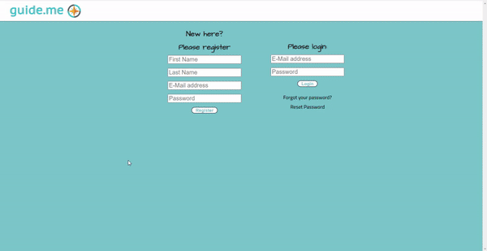
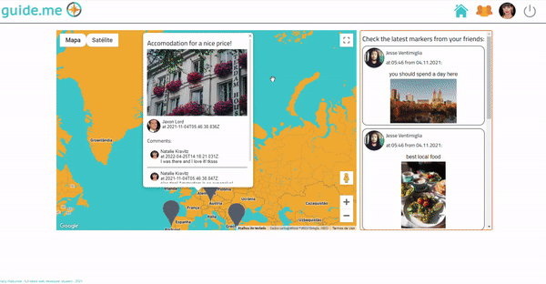
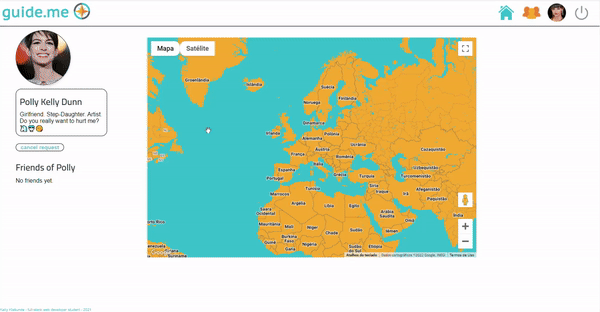

# guide.me :round_pushpin: :earth_africa:
A social network using Google Maps API for friends to share and see each other's travel tips, leave comments, make friendship requests. Bootcamp final project.

# Attention: 
You won’t be able to start the project because of my secrets.json file.

But I invite you to check below some GIFs showing the cool features of this application:

# 1
This first GIF shows a user entering her email and password. She is redirected to the main page, where she sees the latest updates from her friends – on the map and the chronological feed on the right.
She writes a comment on a tag created by one of her friends.

# 2
Here the user goes to the friend’s page and clicks on a user from her list of friends. On her friend’s page, you can see their Bio, their friends, and the pins that one has created. The user goes to her own profile to see her bio and map, You can see that the profile page for the user is a little bit different. The user goes to friend's page again, this time to search for a user. The user visit this profile page and asks for friendship.

# 3
In this last GIF, the user goes to her profile page and edits her bio description. Then, she logged out and logged in the one that the user previously requested a friendship. The current user still doesn’t have any friends so her main page has no data. She will navigate to the friend’s page and accept the invitation. Now on the home page, she sees the pins created by her new friend. 

